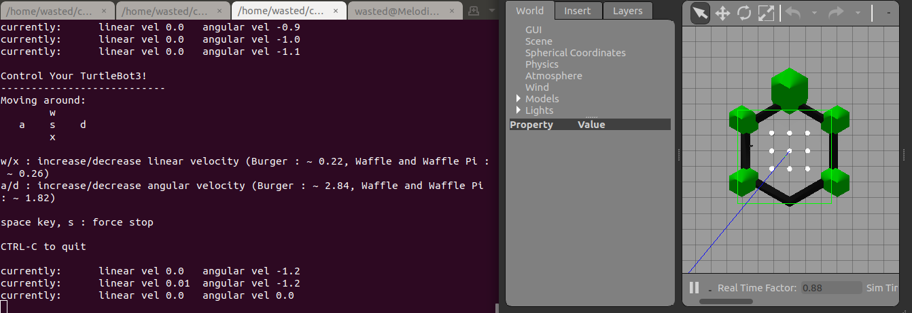
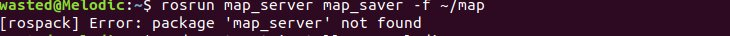

# SLAM-Turtlebot3-simulation-Pathing & Mapping   (Using ROS Melodic)
### Prerequisite:
By now you should have the following packages installed into your workspace/src folder:
1. turtlebo3
2. turtlebot3_msgs
3. turtlebot3_simulations
4. slam_gmapping
5. openslam_gmapping
##### As you should be already done with the positioning and sensing steps, you should have 3 opened terminal windows by now:
1. The Gazebo World window.
2. The SLAM node Rviz window.
3. The teleop turtlebot3 window.
### Now for the pathing and mapping, go back to the teleop turtlebot3 window and start controlling the bot with the  [A-D, W-X and S] buttons in order to move your bot around, and reveal the hidden parts of the map:




### After revealling the map, you can now save the map by entring the following command in a new terminal window:
```ruby
rosrun map_server map_saver -f ~/map
```
### You might face this error:



### You just have to download the package:
```ruby
sudo apt-get install ros-melodic-map-server
```


### now go back to run the command again and you should have the map saved in your HOME files directory in PGM and yaml Estentions:

