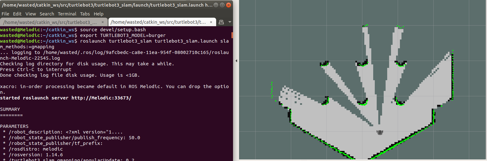
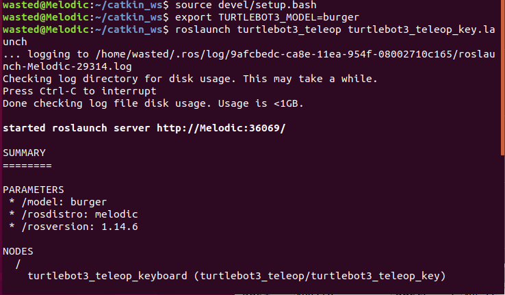

# SLAM-Turtlebot3-simulation-Positioning & Sensing  (Using ROS Melodic)
### Prerequisite:
you should have the following packages installed into your workspace/src folder:
1. turtlebo3
2. turtlebot3_msgs
3. turtlebot3_simulations
### Then we start with prebaring our turtlebot3 Slam packages: 
#### Enter the following commands into your workspace/src folder directory:
```ruby
cd catkin_ws/src 
```
(in my case, the name of my workspace is catkin_ws).
```ruby
git clone https://github.com/ros-perception/slam_gmapping.git
```

```ruby
git clone https://github.com/ros-perception/openslam_gmapping.git
```
#### Then go back to your workspace folder directory and  ``` catkin_make ```.

### Start with running Gazebo World, providing your bot model (in my case: it is burger):
```ruby
source deve;/setup.bash
```
(Used whenever you open a new terminal).
```ruby
export TURTLEBOT3_MODEL=burger
```
```ruby
roslaunch turtlebot3_gazebo turtlebot3_world.launch
```


### Now open a new terminal and export the robot model and run the SLAM node in RViz.
```ruby
source devel/setup.bash
```
```ruby
export TURTLEBOT3_MODEL=burger
```
```ruby
roslaunch turtlebot3_slam turtlebot3_slam.launch slam_methods:=gmapping
```


### For positioning, in order to control a TurtleBot3 with a keyboard. In a new terminal:
```ruby
source devel/setup.bash
```
```ruby
export TURTLEBOT3_MODEL=burger
```
```ruby
roslaunch turtlebot3_teleop turtlebot3_teleop_key.launch
```

### Now you got both the positoning and sensing steps ready with your turtlebot3 simulation

